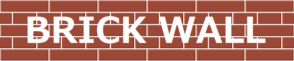

[](https://brickwall.deno.dev)

Brick Wall is simple only HTTP WAF for [Deno](https://deno.com/runtime). 

```ts
import { BrickWall } from 'https://deno.land/x/brick_wall/mod.ts';

const brickWall = new BrickWall({ port: 8001 });
await brickWall.start();
```

## Features

- Simple only HTTP WAF.
- customization
  - static
  - dynamic form API

## Document

[brickwall.deno.dev](https://brickwall.deno.dev)

## Reference

[https://deno.land/x/brick_wall](https://deno.land/x/brick_wall)
